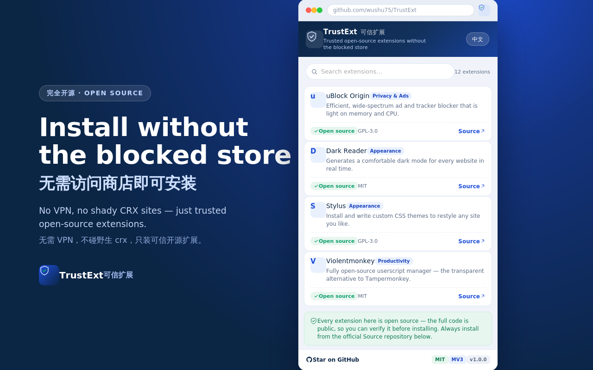
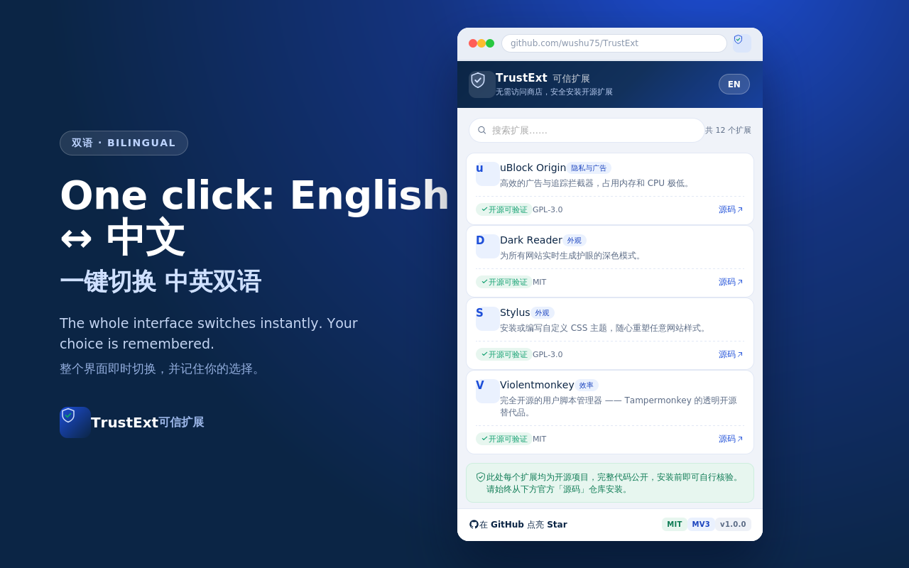

# TrustExt · 可信扩展

**Trusted open-source extensions without the blocked store**
**无需访问商店，安全安装开源扩展**

[English](#english) · [简体中文](#简体中文) · [⭐ Star this repo](https://github.com/wushu75/TrustExt) · [Report an issue](https://github.com/wushu75/TrustExt/issues)

---

## English

### Why TrustExt exists

For millions of Chromium users in mainland China, the **Chrome Web Store is blocked or unreliable**. The usual workarounds are bad ones:

- Spinning up a VPN just to install an ad blocker.
- Downloading `.crx` files from random, unverifiable websites — a real malware risk.
- Giving up and browsing without the tools that make Chrome actually usable.

**TrustExt is a calm, trustworthy launcher.** It ships a hand-checked list of high-quality **open-source** extensions, and for each one it links straight to the **official source repository** so you can verify the code yourself before you install. No accounts, no tracking, no VPN required to browse the list.

> The core idea is simple: **open source + verifiable source = trust you don't have to take on faith.**

### Features

- 🌐 **Bilingual popup** — switch English ↔ 中文 with one click; your choice is remembered.
- ✅ **Curated, honest catalog** — every listed extension is genuinely open source, with its SPDX license shown.
- 🔗 **Direct Source links** — one tap to the official GitHub repo for each extension.
- 🛡️ **Verifiability on every card** — license + source are always visible, never buried.
- 🔒 **Minimal permissions** — the extension requests only `storage` (to remember your language). Nothing else.
- 📦 **Load-unpacked ready** — works offline, no store access needed to run it.
- 🪶 **Tiny & framework-free** — plain HTML/CSS/JS, easy to audit and maintain.

### What's in the catalog (v1.0)

| Extension | What it does | License |
|---|---|---|
| uBlock Origin | Ad & tracker blocker | GPL-3.0 |
| Dark Reader | Dark mode for every site | MIT |
| Stylus | Custom CSS site themes | GPL-3.0 |
| Violentmonkey | Open-source userscript manager | MIT |
| Bitwarden | Password manager | GPL-3.0 |
| Vimium | Keyboard-only navigation | MIT |
| SingleFile | Save a full page as one HTML file | AGPL-3.0 |
| SponsorBlock | Skip YouTube sponsor segments | LGPL-3.0 |
| Privacy Badger | Auto-blocks trackers (EFF) | GPL-3.0 |
| Simple Translate | In-page translation | MIT |
| Refined GitHub | GitHub UX improvements | MIT |
| uBlacklist | Hide content-farm sites from search | MPL-2.0 |

### Screenshots

  
  

A **bilingual landing page** lives in [`docs/index.html`](docs/index.html) — a single self-contained file ready to publish with **GitHub Pages** or **Gitee Pages** (set Pages source to `/docs`).

### Installation

#### A. Load unpacked (works today, no store needed)

1. Download this repo: **Code → Download ZIP**, then unzip — or clone it.
2. Open `chrome://extensions` in Chrome / Edge / Brave / any Chromium browser.
3. Turn on **Developer mode** (top-right).
4. Click **Load unpacked** and select the unzipped `TrustExt` folder.
5. Pin the shield icon and open it — you're set.

> 中文用户：以上步骤对应「加载已解压的扩展程序」，详见下方中文安装指引。

#### B. From the Chrome Web Store

Planned once the listing is approved. When it's live, the link goes here.

### Roadmap

- [x] v1.0 — Bilingual popup, curated open-source catalog, direct source links
- [ ] One-click `.crx` download from **trusted mirrors** you control
- [ ] Auto-update via a self-hosted `update_url` + signed packages
- [ ] Source-reputation signals (stars, last commit, audit status)
- [ ] Community-submitted extensions with a clear review checklist
- [ ] **Gitee mirror** + full Chinese documentation site
- [ ] Category filters & favorites

### Contributing · 参与贡献

Contributions are very welcome — especially adding solid, genuinely open-source extensions that solve real pain points.

**To suggest an extension**, open a PR editing `data/extensions.js` with:

- `name`, `cat` (an existing category key), `license` (SPDX id)
- `source` — the **official** public repository
- `en` and `zh` one-line descriptions

**House rule:** only projects whose *full source is public under an OSI license* get listed. If we can't verify it, we don't ship it.

Run it locally by loading the folder unpacked (see Installation A). No build step required.

### Support this project · 支持本项目

If TrustExt saves you a VPN session, please **⭐ Star the repo** — stars are how Chinese developers discover it and how it stays maintained.

- ⭐ [Star on GitHub](https://github.com/wushu75/TrustExt)
- 🐛 [Open an issue](https://github.com/wushu75/TrustExt/issues) with bugs or extension suggestions
- 🔁 Share it on V2EX / Zhihu / Bilibili / Xiaohongshu

### License

[MIT](LICENSE) © TrustExt contributors. Free forever.

---

## 简体中文

### 为什么会有 TrustExt

对国内数百万 Chromium 用户来说，**Chrome 网上应用店经常无法访问**。常见的「土办法」都不太好：

- 为了装个广告拦截器，专门去开 VPN。
- 从来路不明的网站下载 `.crx` —— 有真实的恶意软件风险。
- 干脆不装，忍受一个「不好用」的浏览器。

**TrustExt 是一个安心、可信的扩展导航器。** 它内置一份经过人工核对的高质量**开源**扩展清单，并为每个扩展直接附上**官方源码仓库**链接，让你在安装前就能自己核验代码。浏览列表无需账号、无需追踪、无需 VPN。

> 核心理念很简单：**开源 + 可核验的源码 = 无需盲信的信任。**

### 功能特性

- 🌐 **双语弹窗** —— 一键切换 English ↔ 中文，并记住你的选择。
- ✅ **精选且诚实的清单** —— 列表中每个扩展都是真正的开源项目，并标注 SPDX 许可证。
- 🔗 **直达源码** —— 一键打开每个扩展的官方 GitHub 仓库。
- 🛡️ **每张卡片都可核验** —— 许可证与源码链接始终可见，绝不隐藏。
- 🔒 **最小权限** —— 仅申请 `storage`（用于记住语言偏好），别无其他。
- 📦 **可离线加载** —— 「加载已解压的扩展程序」即可使用，无需访问商店。
- 🪶 **极简无框架** —— 纯 HTML/CSS/JS，易于审计和维护。

### 内置清单（v1.0）

清单涵盖广告拦截（uBlock Origin）、深色模式（Dark Reader）、自定义样式（Stylus）、开源脚本管理器（Violentmonkey）、密码管理（Bitwarden）、键盘操作（Vimium）、整页保存（SingleFile）、跳过口播广告（SponsorBlock）、反追踪（Privacy Badger）、就地翻译（Simple Translate）、GitHub 体验优化（Refined GitHub）、以及从搜索结果中屏蔽内容农场的 uBlacklist。完整表格见上方英文部分。

### 安装方法：加载已解压的扩展程序

1. 下载本仓库：点击 **Code → Download ZIP** 并解压（或直接 clone）。
2. 在浏览器地址栏打开 `chrome://extensions`。
3. 打开右上角的 **开发者模式**。
4. 点击 **加载已解压的扩展程序**，选择解压后的 `TrustExt` 文件夹。
5. 固定图标并打开即可使用。

> 未来商店上架后，将在此处提供网上应用店安装链接。

### 路线图

- [x] v1.0 —— 双语弹窗、精选开源清单、直达源码
- [ ] 从**可信镜像**一键下载 `.crx`
- [ ] 通过自建 `update_url` + 签名包实现自动更新
- [ ] 源码信誉信号（Star 数、最近提交、审计状态）
- [ ] 社区提交扩展 + 明确的审核清单
- [ ] **Gitee 镜像** + 完整中文文档站
- [ ] 分类筛选与收藏

### 参与贡献

非常欢迎贡献，尤其是补充真正开源、能解决实际痛点的优质扩展。

**推荐扩展** 请提交 PR 修改 `data/extensions.js`，包含：`name`、`cat`（已有分类键）、`license`（SPDX 标识）、`source`（**官方** 公开仓库）、以及中英各一句 `zh` / `en` 描述。

**收录规则：** 只收录*完整源码以 OSI 许可证公开*的项目。无法核验的，一律不收录。

### 支持本项目

如果 TrustExt 帮你省下了一次开 VPN 的麻烦，欢迎 **⭐ 点亮 Star** —— Star 是国内开发者发现它、也是它能持续维护的关键。

- ⭐ [在 GitHub 点 Star](https://github.com/wushu75/TrustExt)
- 🐛 [提交 issue](https://github.com/wushu75/TrustExt/issues)，反馈问题或推荐扩展
- 🔁 欢迎转发到 V2EX / 知乎 / 哔哩哔哩 / 小红书

### 开源许可

[MIT](LICENSE) © TrustExt 贡献者。永久免费。

---

Made for the open web · 为开放的互联网而做

**[⭐ Star TrustExt](https://github.com/wushu75/TrustExt)**

